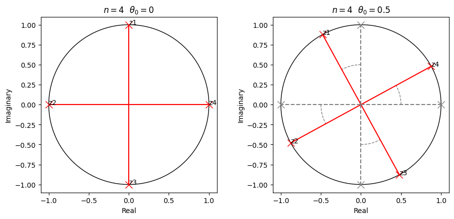
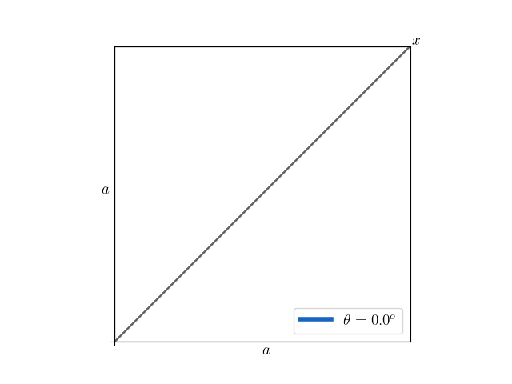

# Math Blog

A repository for sharing my own math explanations, problems and more.

_By Dylan Tintenfich._

## The Complex Circle Problem

Consider a circle of radius one centered at the origin of a complex plane. Given an $n \in \mathbb{N}$ and $\theta_0 \in \mathbb{R}$, find the product of the $n$ complex numbers $z_1, \dots, z_{n}$ that represent the $n$ equal parts into which the circle is divided, considering all possible rotations of these parts by $\theta_0$, the angle between the *x-axis* to the last complex number $z_{n}$ (i.e., $z_{n} = \cos\theta_0 + i \sin\theta_0$).

  

[_See more_.](./complex_circle_problem/complex_circle.ipynb)

## The Triangle Problem

  

Find the value of $x$ given $\theta \in (0, \frac{\pi}{2}]$ and $a \in \mathbb{R}^{+}$

[_See more_.](./triangle_problem/triangle_problem.md)