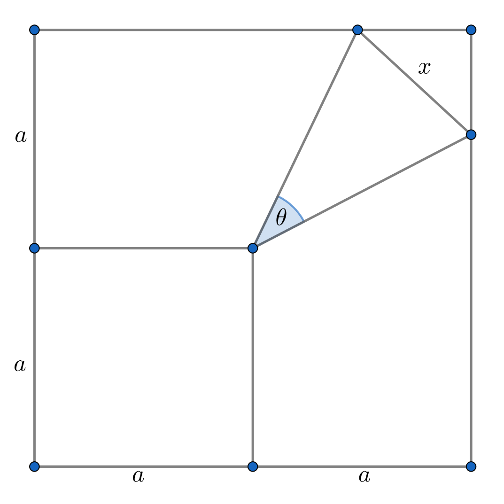

# Math Blog

A repository for sharing my own math explanations, problems and more.

_By Dylan Tintenfich._

## The Complex Circle Problem

Consider a circle of radius one centered at the origin of a complex plane. Given an integer $n$ and an angle $\theta_0$, how can we determine the product of the $n$ complex numbers $z_1, \dots, z_{n}$ that represent the $n$ equal parts into which the circle is divided, considering all possible rotations of these parts by angle $\theta_0$?

**Note:** let $\theta_0$ be the angle between the *x-axis* to the last complex number $z_{n}$. This means that, when $\theta_0 = 0$, $z_{n} = 1 + 0i$.

[_See more_.](./complex_circle_problem/complex_circle.ipynb)

## The Triangle Problem

  

Find the value of $x$ given $\theta \in (0, \pi)$ and $a \in \mathbb{R}^{+}$

[_See more_.](./triangle_problem/triangle_problem.md)