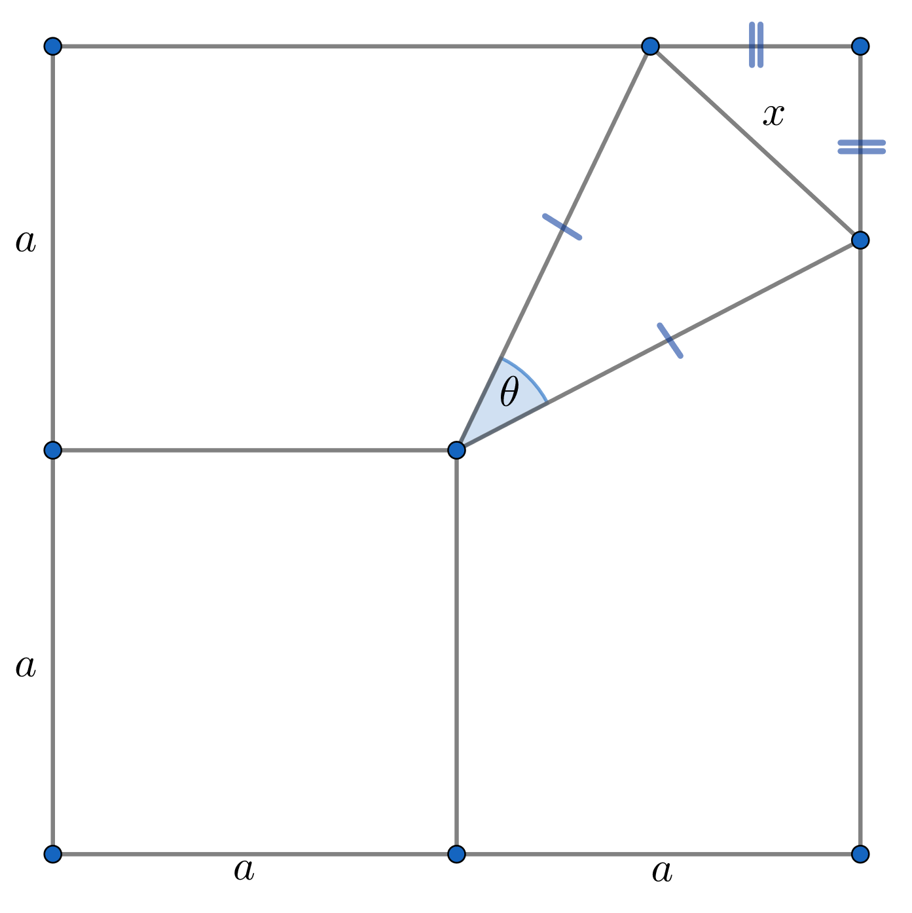
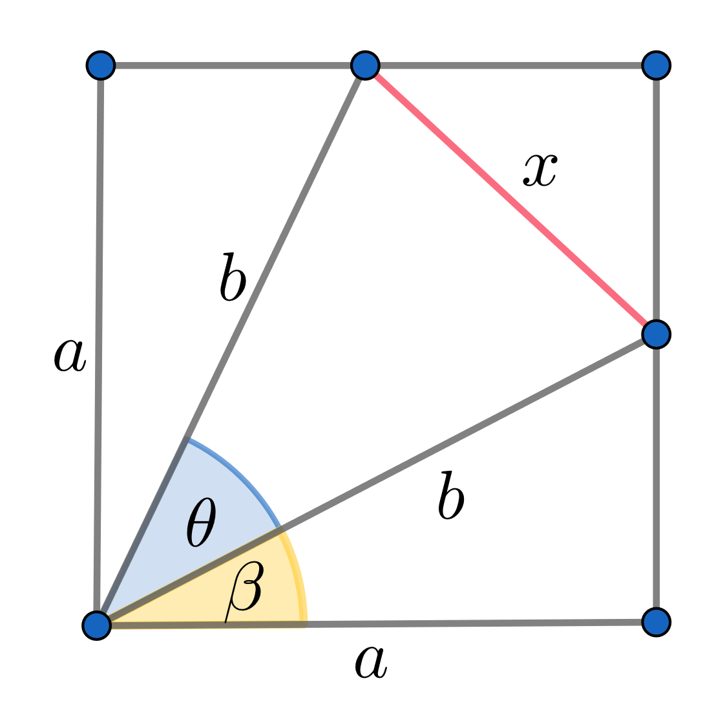

# The Triangle Problem

## Statement

  

Find the value of $x$ given $\theta \in (0, \pi)$ and $a \in \mathbb{R}^{+}$

## Solution

#### Defining $x$ in terms of $b$

First, let's define a new variable $b$ equal to the length of the two remaining sides of the triangle 

  

We can now write $x$ in terms of $b$ and $\theta$

  

$$
\begin{align*}
\sin(\frac{\theta}{2}) &= \frac{x/2}{b}\\
x &= 2 b \sin(\frac{\theta}{2})
\end{align*}
$$

#### Finding $b$ value

Now we have to find the value of $b$

  

$$
\begin{align*}
\cos(\beta) &= \frac{a}{b}\\
b &= \frac{a}{\cos(\beta)}
\end{align*}
$$

To calculate $\cos(\beta)$, keep in mind that $2\beta + \theta = \frac{\pi}{2}$

$$
\begin{align*}
2\beta + \theta &= \frac{\pi}{2}\\
2\beta &= \frac{\pi}{2} - \theta\\
\beta &= \frac{\frac{\pi}{2} - \theta}{2}
\end{align*}
$$

Then 

$$
\begin{align*}
\cos(\beta) &= \cos(\frac{\frac{\pi}{2} - \theta}{2})\\
&= \cos(\frac{\theta - \frac{\pi}{2}}{2})\\
&= \cos(\frac{\theta}{2} - \frac{\pi}{4})\\
&= \cos(\frac{\theta}{2}) \cos(\frac{\pi}{4}) + \sin(\frac{\theta}{2}) \sin(\frac{\pi}{4})\\
&= \frac{1}{\sqrt{2}} [\cos(\frac{\theta}{2}) + \sin(\frac{\theta}{2})]
\end{align*}
$$

and

$$
b = \frac{a\sqrt{2}}{\cos(\frac{\theta}{2}) + \sin(\frac{\theta}{2})}
$$

#### Finding $x$

$$
\begin{align*}
x &= 2 b \sin(\frac{\theta}{2})\\
&= 2 \sqrt{2} a \frac{\sin(\frac{\theta}{2})}{\sin(\frac{\theta}{2}) + \cos(\frac{\theta}{2})}\\
&= \sqrt{8} a (\frac{\sin(\frac{\theta}{2}) + \cos(\frac{\theta}{2})}{\sin(\frac{\theta}{2})})^{-1}\\
&= \sqrt{8} a (1 + \frac{\cos(\frac{\theta}{2})}{\sin(\frac{\theta}{2})})^{-1}\\
&= \sqrt{8} a \frac{1}{1 + \cot(\frac{\theta}{2})}\\
\therefore x &= \frac{\sqrt{8} a}{1 + \cot(\frac{\theta}{2})}
\end{align*}
$$